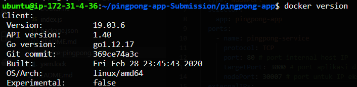
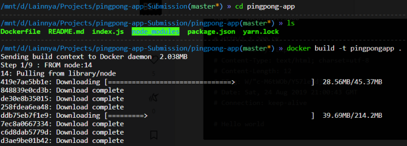
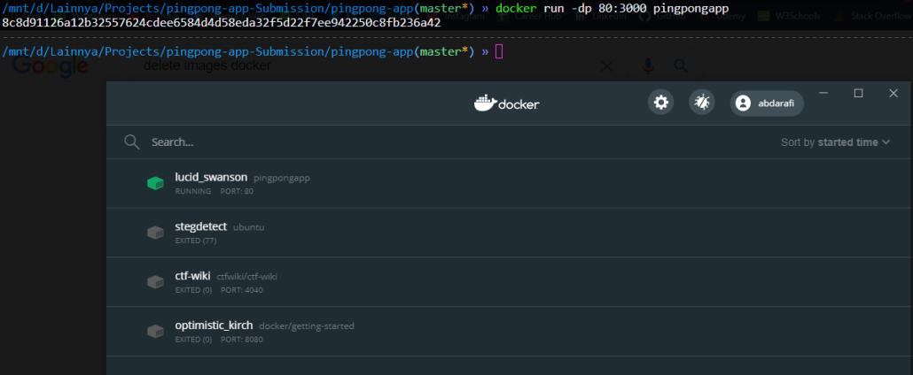
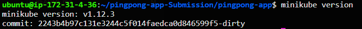
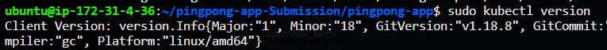
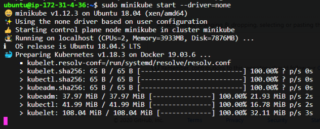
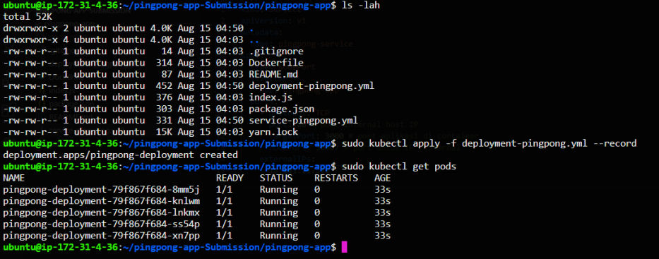
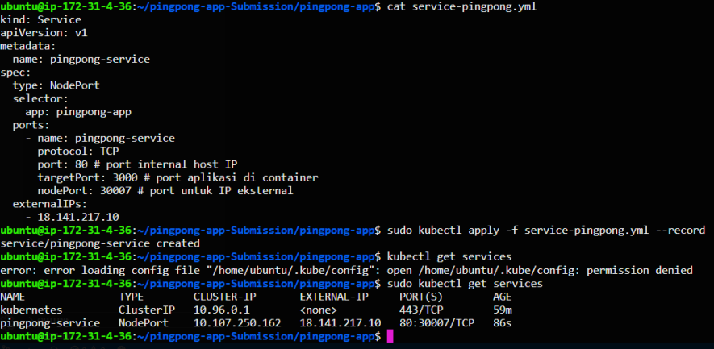
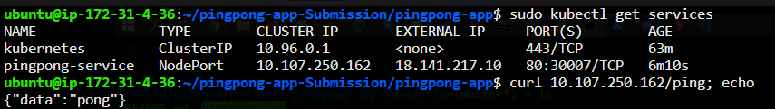
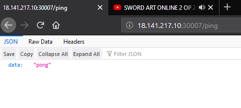

# Submission Ping Pong App

## My Setup
* Laptop MSI GP62 with WSL2
* AWS EC2 **t2.medium** with Ubuntu 18.04 LTS to deploy the app

### Dockerise the App

1. Langkah pertama pastikan docker sudah terinstall. Dapat diperiksa dengan perintah

   ```bash	
   docker version
   ```

   

   Jika belum, dapat diinstall dengan nama package `docker.io`

2. Lalu buat file bernama Dockerfile untuk membuat images dari aplikasi ping pong yang diberikan, berikut adalah isi dari Dockerfile:

   ```dockerfile
   # inisialisasi base image dari node
   FROM node:14 
   LABEL Abda Rafi H <abda_rafi@yahoo.com>
   # membuat workdir
   WORKDIR /app 
   # copy seluruh file yang dibutuhkan ke workdir supaya app berjalan
   COPY package.json /app 
   COPY yarn.lock /app
   RUN yarn install 
   COPY . /app 
   # menjalankan aplikasi
   CMD yarn start 
   EXPOSE 3000
   ```

   Untuk syntax atau perintah dalam membuat dockerfile dapat dibaca di [docs](https://docs.docker.com/engine/reference/builder/)

3. Setelah dockerfile dibuat, maka selanjutnya adalah membuat images docker, dengan perintah

   ```bash
   docker build -t pingpongapp .
   ```



​		flag -t adalah nama atau tag dari image yang akan dibuat

4. Setelah itu, jalankan docker container dari image yang telah dibuat dengan perintah

   ```bash
   docker run -dp 80:3000 
   ```

   flag -dp adalah membuat container running background dan memetakan port local container (3000) menjadi port 80 pada Host.

5. Container sukses dijalankan dengan image yang dibuat.

   

### Deployment with Minikube

1. Pastikan bahwa CPU lebih dari 2, lalu langkah selanjutnya adalah dengan menginstall minikube, dapat dilakukan dengan perintah

   ```bash
   curl -Lo minikube https://storage.googleapis.com/minikube/releases/latest/minikube-linux-amd64 \
     && chmod +x minikube
   ```

   ```bash
   sudo mkdir -p /usr/local/bin/
   sudo install minikube /usr/local/bin/
   ```

   Pastikan minikube sudah terinstall dengan baik.

   

2. Karena minikube ini berjalan dengan kubernetes, maka perlu menginstall kubectl. Installasi kubernetes dapat dilihat pada dokumentasi berikut

   https://kubernetes.io/docs/tasks/tools/install-kubectl/

   Pastikan kubectl sudah terinstall.

   

3. Selanjutnya adalah menjalankan minikube dengan perintah

   ```bash 
   minikube start --driver=none
   ```

   tag driver=none diperlukan karena kita menjalankan pada VM.

   

4. Karena kita akan deploy aplikasi dari image docker yang dibuat sebelumnya di minikube, maka perlu membuat script yaml untuk deployment dalam bentuk pod. Buat file bernama **deployment-pingpong.yml** yang isinya adalah sebagai berikut

   ```yaml
   apiVersion: apps/v1
   kind: Deployment
   metadata:
     name: pingpong-deployment
   spec:
     replicas: 5 #bikin lima biar mantab.
     selector:
       matchLabels:
         app: pingpong-app
     template:
       metadata:
         labels:
           app: pingpong-app
       spec:
         containers:
           - name: pingpong-container
             image: pingpongapp:latest #image dari yang telah dibuat
             imagePullPolicy: Never
             ports:
               - containerPort: 3000
   ```

   Disini saya buat replika sebanyak 5 buah, lalu jalankan script tersebut dengan perintah

   ```bash
   kubectl apply -f deployment-pingpong.yml --record
   ```

   tag --record berguna untuk introspeksi konfigurasi kedepan.

   

5. Setelah itu buat file script **service-pingpong.yml** yang diperlukan untuk mengatur pod-pod yang telah kita deploy sebelumya. Isi dari file tersebut adalah

   ```yaml
   kind: Service
   apiVersion: v1
   metadata:
     name: pingpong-service
   spec:
     type: NodePort
     selector:
       app: pingpong-app
     ports:
       - name: pingpong-service
         protocol: TCP
         port: 80 # port internal host IP
         targetPort: 3000 # port aplikasi di container
         nodePort: 30007 # port untuk IP eksternal
     externalIPs:
       - 18.141.217.10
   ```

   Karena saya menggunakan AWS, maka saya tambahkan elemen externalIPs. Lalu jalankan script tersebut dengan perintah

   ```bash
   kubectl apply -f service-pingpong.yml --record
   ```

   

6. Aplikasi telah sukses di-deploy menggunakan minikube+k8s. 

   



Aplikasi dapat diakses pada http://18.141.217.10:30007/ jika Instance AWS saya masih berjalan.